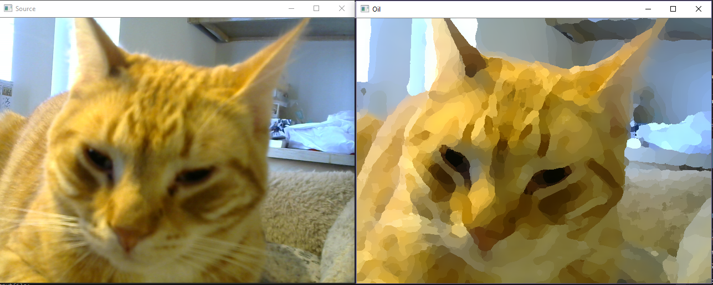
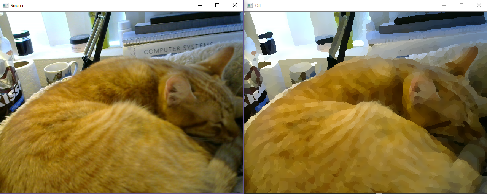

# oil_paint

The project is implementing an oil paint algorithm on captured video via a webcam Logitech HD 720.

Demo:

radius:8, IntensityLevel:20

radius:5, IntensityLevel:20

I use OpenCV to take care of vedio capturing and frames showing. 
Then, I use CUDA to take care of oil painting algorithm by assigning one thread with one pixel.
